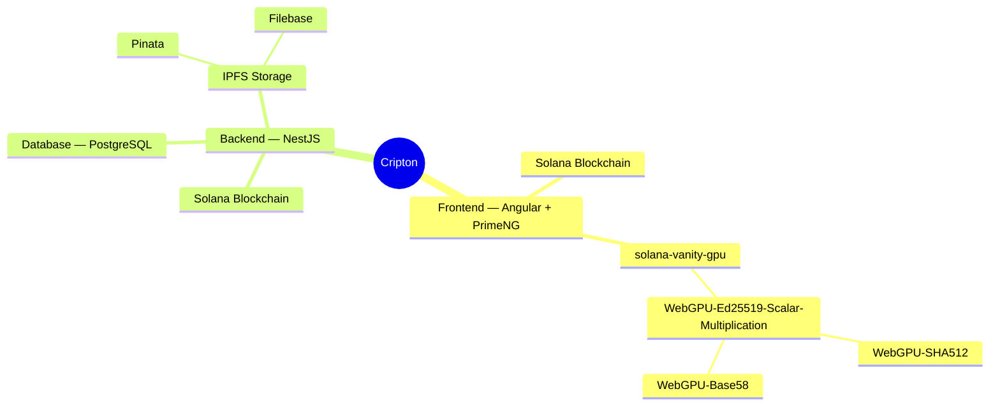

# Cripton

## Demo

The app is up and running at https://cripton.app 💻

## Project Structure

Cripton is split into 5 repositories, and a nice way to understand the structure is to look at this mind map:

As most other web-based applications, Cripton is generally split into backend and frontend that communicate with each other via REST API. Backend is built on NestJS, ...

## Features

- Light/dark mode toggle
- Live previews
- Fullscreen mode
- Cross platform

## Run locally

## Running Tests

There are no unit or end-to-end tests implemented yet. But a contribution would be extremely valuable.

## Roadmap

## License

## Authors

- [@Dcfgvy](https://www.github.com/Dcfgvy)

