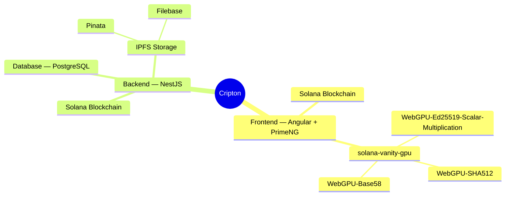
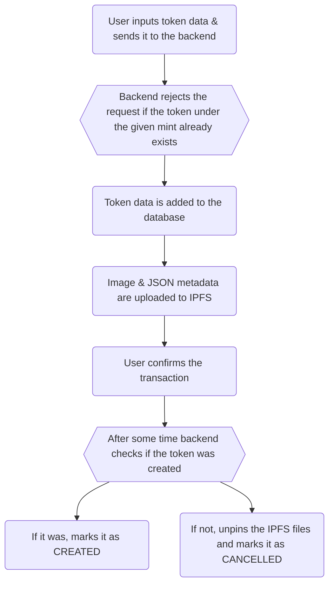

# Cripton — Solana token launcher & manager

<p align="center">


</p>

Cripton is an **open-source full-stack web3-based** application for creating and managing custom [SPL tokens](https://solana.com/docs/tokens) on Solana in a **user-friendly, Token Program-agnostic, and gas-efficient** web interface.

## Demo

The app would've been up and running if the equipment in the Qupra DC2 data center wouldn't overheat on 29.06.2026: [https://cripton.app](https://cripton.app) 💻 Try it out!

## Philosophy

SPL tokens on Solana offer a wide range of applications for all types of users due to their **flexibility** and **Solana's [high-speed high-throughput](https://www.ainvest.com/news/top-7-blockchains-tps-2025-ranking-fastest-networks-transactions-2508/) architecture**. There are *endless* possibilities of SPL tokens' applications, but some common examples include using SPL tokens for peer-to-peer payments, Decentralized Finance, cashback programs, gaming (in-game currency, experience points), paying for subscriptions or usage credits, Patron memberships, charity donations, or sometimes you just want to create a meme coin. The list goes on and on.

However, most GUI applications for creating and managing tokens on Solana that are available online are either **low-quality solutions**, or they are **closed-source** products developed by corporations and are **heavily overpriced** for a casual user. 

Cripton aims to close the gap between the technicality of manually programming the RPC calls and having to use low-quality or overpriced solutions by offering a **highly customizable user-friendly** Solana toolkit with every tool **packed with the features** users are likely to need and building gas-efficient transactions to **save on compute units costs**.

## Project Structure & Technologies Used

Cripton is split into 5 git repositories, and a nice way to understand the structure is to look at this mind map:



As most other web-based applications, Cripton is generally split into backend and frontend that communicate with each other via **REST API**. Backend is built on [**NestJS**](https://nestjs.com/) — a progressive Node.js framework, and frontend — on [**Angular**](https://v19.angular.dev/). Because the app is built around the **Solana blockchain**, external libraries like `@solana/web3.js`, `@metaplex-foundation/umi`, and `@solana/wallet-adapter` are heavily used for building transactions, communicating with user wallets, and generally interacting with Solana on both frontend and backend.

More details on the stack used:
- Frontend uses [PrimeNG](https://v19.primeng.org/) components & styles library for UI. In the mindmap you can also see libraries `solana-vanity-gpu`, `WebGPU-Ed25519-Scalar-Multiplication`, `WebGPU-SHA512`, and `WebGPU-Base58`, which were all customly created for Cripton with one goal in mind: <b>perform [vanity keypair](https://www.reddit.com/r/BitcoinBeginners/comments/7y8i6k/what_is_a_vanity_key/) search on the GPU directly in the browser</b>. For this task Cripton uses <b>WebGPU</b> — a relatively new JavaScript API for general-purpose GPU computing. More on that in the Main Features section.
- Backend follows a pretty common Nest application architecture with **Express HTTP Server** under the hood. The database used is [PostgreSQL](https://www.postgresql.org/), and it's mainly needed to just store service prices, referral links information, and links to images and token metadata files in the [IPFS storage](https://ipfs.tech/). IPFS is a decentralized file system where all the user-uploaded content like token metadata and images actually lives. Cripton supports [Pinata](https://pinata.cloud/) and [Filebase](https://filebase.com/) as [IPFS pinning services](https://pinata.cloud/blog/what-is-an-ipfs-pinning-service/), currently Filebase is used in production.
- Currently the app uses [dRPC](https://drpc.org/) as the RPC provider for production, but you can use whatever RPC provider you want — it's just a link.
- In production, all components of the app (frontend, backend, database) are running as [Docker](https://www.docker.com/) containers. In development only the database is dockerized, and frontend and backend run as normal Node.js processes.

<ins>*Note*</ins>: READMEs in frontend and backend repositories are not as elaborate about the project as this documentation. They mostly contain front or backend-specific code architechture explanations and installation & setup guides.

Links to git repositories:
- [Frontend](https://github.com/Dcfgvy/cripton-frontend)
- [Backend](https://github.com/Dcfgvy/cripton-backend)
- [WebGPU-Ed25519-Scalar-Multiplication](https://github.com/Dcfgvy/WebGPU-Ed25519-Scalar-Multiplication)
- [WebGPU-SHA512](https://github.com/Dcfgvy/WebGPU-SHA512)
- [WebGPU-Base58](https://github.com/Dcfgvy/WebGPU-Base58)

## Concepts

A general understanding of [how Solana works](https://solana.com/docs/core) and especially [how SPL tokens on Solana work](https://solana.com/docs/tokens) would be very helpful for understanding the project.

Knowing the fundamentals of WebGPU is needed to understand how vanity keypair search on the GPU works. [Here](https://webgpufundamentals.org/webgpu/lessons/webgpu-fundamentals.html) is really nice introductory article.

It is also important to understand the difference between on-chain metadata like Metaplex or Token Metadata Extension and off-chain JSON metadata. On-chain metadata only the required properties to save space, while off-chain metadata usually lives in decentralized storages and can have a much bigger variety of properties (like tags, image, social links, etc.) — it is a JSON, you can put whatever you want in there. On-chain metadata almost always includes a link to off-chain metadata and, unlike off-chain metadata, it has the update authority property.

In the end, most tools in Cripton generate one or more Solana transactions with all the necessary instructions, which are then sent to the user wallet for signing. The signed transaction is then sent to the selected Solana network for confirmation. Confirmation is not the "final stage" of a Solana transaction and theoretically it can still be reverted under catastrophic network failures, this has never happened in Solana's history though.

## Main Features

### Token Creator

Creating tokens is the most basic tool you'll need to manage your tokens, otherwise you have nothing to manage. Token Creator creates legacy Solana SPL tokens & [Metaplex Metadata](https://solana.com/docs/tokens/metaplex) for compatiblity, as many other services may not fully support the comparatively new [Token Extensions Program](https://solana.com/docs/tokens/extensions). The original SPL tokens are further referred to as SPL tokens and the Token Extensions Program tokens are further referred to as Token 2022 tokens.

Solana Token Creator lets users customize the following across 3 token creation steps:
- Token name, symbol, and decimals
- Logo and description of the token
- Social links (website, Twitter, Telegram, Discord, Youtube, Medium, Github, Instagram, Reddit, Facebook)
- Token tags associated with the project
- Edit or remove creator information (creator name, website)
- Set or Generate a custom address for the token using the vanity keypair search on the GPU or, if not available, multithreaded search on the CPU
- Set and distribute the initial token supply across different wallets
- Revoke or transfer [Freeze](https://solana.com/docs/tokens/basics/freeze-account), [Mint](https://solana.com/docs/tokens/basics/mint-tokens) authority
- Revoke or transfer token metadata Update authority

Before the transactions is sent, the logo image & additional JSON metadata need to be uploaded to some decentralized storage first. The backend saves the image and JSON metadata to IPFS, while saving the future mint address associated with those files into its database. This step is needed to later remove the files of a not created token (e.g. the user clicks "Confirm" in Cripton interface, metadata gets uploaded, and then the user quits without confirming the token creation transaction) from IPFS pinning service, as saving data there generally costs money.

A pseudo-random seed is added into the image metadata of each token logo for a very specific reason. Imagine 2 users want to create a token with exactly the same logo (like a popular meme). Then the hash will also be the same which, if the file names were the same, would lead to the same [IPFS CID](https://docs.ipfs.tech/concepts/content-addressing/#what-is-a-cid). Then the first user does end up creating the token, and the second one does not. Cripton will notice that the token was not created after some period of time and will unpin the logo & JSON metadata files associated with that token. In this case the first user will have their token logo removed just because it matched the logo of another token that was not created. The good think is that the file names also include the token mint and a random seed, but a second layer of defense is always beneficial.

This flow chart demonstrates the whole token creation process:



### Multisender

Multisender is the tool for transferring SOL or SPL tokens or Token 2022 tokens to multiple recipients in bulk in as few transactions as possible.

User can either input the transfers data manually or upload a text file in the format "Address,Amount\n" for every transfer. Alternatively, the same amount can be used for all transfers.

Features:
- **Offset Transfer Fees**. Some Token 2022 tokens have the [Transfer Fees](https://solana.com/docs/tokens/extensions/transfer-fees) extension, which reduces the transfer amount by some configured fee. By offsetting the fees the user will pay more so that the recipient still gets the desired amount.
- **Ignoring Creator Royalties**. Some SPL tokens may have Creator Royalties configured in the Metaplex Metadata. Creator Royalties are essentially a fee that is suggested to be paid to the creators on every sale or transfer of a token, but it can be ignored.
- **As few transactions as possible**. The max size of a Solana transactions is 1232 bytes. Cripton packs the transfers instructions until there is no place left in every transactions, thus the total number of transactions and therefore network fees is minimized, which is good for both user experience (only 1 transaction at a time can be approved) and user wallet. In order to minimize the instructions count all the developer fees, referral fees, and creator royalties are paid upfront in the first transaction for the whole set of transactions.

### ✨ Vanity keypair search on the GPU ✨

Vanity keypair is a keypair whose public key follows a specific pattern, in most cases a prefix and/or a suffix, for example a keypair starting with "hey...".

For keypair generation Solana uses Ed25519 curve cryptography with some extra steps:
1. Take a pseudo-random 32-bytes seed. This will be the private key.
2. Hash this seed with SHA-512
3. Take the first 32 bytes of the hash and clamp them in a specific way
4. Interpret the byte array from step 3 as a little-endian integer `a`
5. Perform scalar point multiplication `A = a * B`, where B is a point with B.y = 4/5 and positive B.x
6. Compress the resulting point to 32 bytes `compressed = A.y + (sign(A.x) << 255)` (operations are performed `mod 2^255 - 19`, so the MSB of `A.y` is always 0)
7. Interpret `compressed` as a byte string and convert to Base58. The final text string will be the familiar Solana Base58 public key.

We can see that because of hashing and point multiplication the only way to find a keypair we want is to just brute-force the search. That means just trying with random seeds until we find the public key pattern we want. This task is very similar to the Proof of Work mechanism used, for example, in Bitcoin, where miners race to find a nonce that would create a hash starting with a certain number of zeros. And GPUs are ideal for this! In order to do that in the browser environment WebGPU, a relatively new JavaScript API for general-purpose GPU computing, is used. Specifically, compute shaders are used for all the computation, something that is not available in the older APIs like [WebGL](https://en.wikipedia.org/wiki/WebGL).

Unfortunately, there were no shaders for SHA-512 hashing, Base58 encoding or Ed25519 scalar multiplication available anywhere online, so all of them had to be created from basically zero for this project. `WebGPU-SHA512`, `WebGPU-Base58`, and `WebGPU-Ed25519-Scalar-Multiplication` repositories contain [WGSL](https://www.w3.org/TR/WGSL/) (WebGPU Shading Language) code for the respective compute shaders. `WebGPU-Ed25519-Scalar-Multiplication` is based on [Daniel J. Bernstein's ref10 reference implementation in C](https://github.com/floodyberry/supercop/tree/master/crypto_sign/ed25519/ref10) as well as the fixed-base comb method for scalar multiplication and some other papers. Find more details in the respective repositories.

The 3 repositories with WGSL code are all combined in `solana-vanity-gpu` library where the actual search is finally performed, `solana-vanity-gpu` is part of the frontend repository. Pseudo-random private keys are generated the following way:
1. On the JS-side, 32 bytes are seeded with seeded with cryptographically secure bytes.
2. We dispatch `2^n` workgroups of size `256`. Thus we get `2^(n + 8)` threads that have a unique global id ranging from `0` to `2^(n + 8) - 1`. In order to get a unique seed for each thread we just replace the last `n + 8` bits in our initial seed with the current thread's global id.
3. Afterwards just perform the procedure described above with the seed we got in step 2 and check if the public key matches the pattern. In case it does, save the private key to a storage buffer.

User can input a prefix and/or a suffix (only the charachters in Base58 allowed), specify if he wants a case-sensitive search and whether he wants to use the GPU. It is used by default but sometimes does not work, so only the multi-threaded JavaScript CPU search will be used (a number of web workers will be initialized equal to the number of threads on the CPU).

GPU search will only work if the total length of the pattern is more than 1. The "speed" just controls the value of `n`. It does <ins>not</ins> mean though that decreasing `n` by 1 will decrease the search speed by a factor of 2 ...

This feature is called Custom Address in the UI.

### Copying trending tokens

The backend scans [Pump Fun](https://pump.fun/) for the currently trending meme coins (tokens with high growth & engagement), fetches their data, and stores them in a cache in a format convenient for replication. All that happens every few seconds.

On the frontend side, unless Live Updates are off, these trending tokens are constantly pulled and displayed to the user. Copying an existing token follows almost the same workflow as creating a new token, except that the image and JSON metadata uploads are skipped because the token already has its metadata hosted.

For replicated tokens the following applies:
- The creator in the Metaplex metadata is the creator of the original token
- Mint and Freeze authorities are revoked
- The Metaplex Metadata update authority is Pump Fun's mint address
- Metadata becomes immutable

### Affiliate Program

Cripton has an affiliate program to promote the app and it follows a pretty common approach. The referrer can generate a referral link tied to his crypto wallets (for now only Solana), which he can use to recommend Cripton. The link is stored in the database on the backend. When a referee click on a referral link, the referrer data is added to the user's `localStorage`. Based on the current rate, some percent of the service fees paid in every Cripton tool will be automatically sent to the referrer – there will be just one more `transfer` instruction in any transaction.

It is important to understand that **total fees ≠ service fees**. If the total fees are `0.1 SOL` and the network fee is `0.02 SOL`, the royalty will be deducted from `0.08 SOL`, not from `0.1 SOL`. Also, the **referral data lives in user's browser cache**, so clearing it will remove the earnings for the referrer from that referee. This design is intended so that a user is not obligated to pay to his referrer for their whole life.

Example of an affiliate link: `https://cripton.app/?r=9HhwWgJm`

## Run Locally

In order to run Cripton locally, you'll need to follow the installation & setup guides in the frontend and backend repositories. For the project to function properly, frontend, backend, and PosgreSQL database (included in the backend) should run simultaneously on your device.

Running frontend and backend in development environment is *good enough*. If you really want to, you can always build and run the app in production mode, but that will highly unlikely result in any visible improvements.

There are several **benefits of running Cripton locally**:
- Get access to the Solana Mainnet (it is currently not available in production for legal reasons)
- Configure custom prices on tools
- Not pay any developer fees at all or send them to the wallet of your choice

## (Not) Running Tests

There are no unit or end-to-end tests implemented yet. All `.spec` files were auto-generated by Nest and Angular CLI and, for now, just contain the default placeholders. The reason to omit tests was to speed up the development process. A contribution with implementations of any sort of tests would be extremely valuable.

## Roadmap

- Firefox support of vanity keypair search on the GPU
- Add unit and end-to-end tests
- Mint/Burn Solana tokens
- Freeze/Thaw Solana tokens
- Snapshotting token holders
- Liquidity Pools Manager: bridge multiple DEXes (Raydium, Orca, etc.) into 1 interface
- Extend Cripton to other blockchains (EVM, TON, SUI)

## Contributing

Contributions are welcome! Whether you'd like to report a bug, implement a new feature, improve the documentation, or submit code, your help is appreciated.

### Getting Started

1. Fork the repository.
2. Create a new branch:
   ```sh
   git checkout -b feature/my-feature
   ```
3. Make your changes.
4. Commit your changes with clear commit messages.
5. Push your branch and open a Pull Request.

## Licenses

Frontend & backend are under GNU General Public License v3.<br>
`WebGPU-Ed25519-Scalar-Multiplication`, `WebGPU-SHA512`, and `WebGPU-Base58` are under the MIT License.<br>
This documentation is under Creative Commons Attribution-ShareAlike 4.0 License.

[](https://www.gnu.org/licenses/gpl-3.0)<br>
[](https://opensource.org/licenses/MIT)
[](https://creativecommons.org/licenses/by-sa/4.0/)

## Authors

- [@Dcfgvy](https://www.github.com/Dcfgvy)


