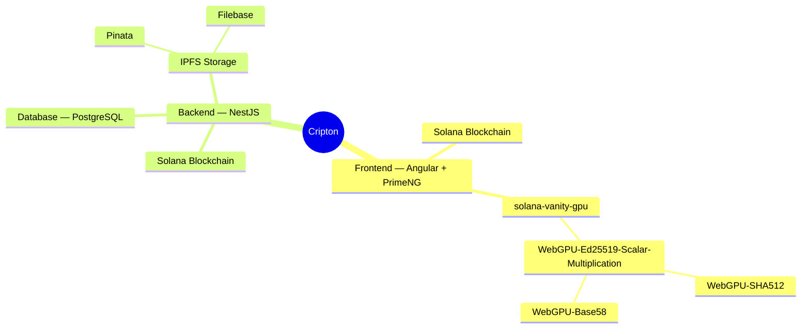

# Cripton

## Demo

The app is up and running at https://cripton.app 💻

## Philosophy

## Project Structure & Technologies Used

Cripton is split into 5 git repositories, and a nice way to understand the structure is to look at this mind map:

As most other web-based applications, Cripton is generally split into backend and frontend that communicate with each other via REST API. Backend is built on NestJS — a progressive Node.js framework, and frontend — on Angular. Because the app is built around the Solana blockchain, external libraries like `@solana/web3.js`, `@metaplex-foundation/umi`, and `@solana/wallet-adapter` are heavily used for building transactions, communicating with user wallets, and generally interacting with Solana on both frontend and backend.

More details on the stack used:
- Frontend uses [PrimeNG](https://v19.primeng.org/) components & styles library for UI. In the mindmap you can also see libraries `solana-vanity-gpu`, `WebGPU-Ed25519-Scalar-Multiplication`, `WebGPU-SHA512`, and `WebGPU-Base58`, which were all customly created for Cripton with one goal in mind: <b>perform [vanity keypair](https://www.reddit.com/r/BitcoinBeginners/comments/7y8i6k/what_is_a_vanity_key/) search on the GPU directly in the browser</b>. For this task Cripton uses <b>WebGPU</b> — a relatively new JavaScript API for general-purpose GPU computing. More on that in the Features section.
- Backend follows a pretty common Nest app architecture. It uses [PostgreSQL](https://www.postgresql.org/) as its database, which is mainly needed to just store service prices, referral links information, and links to images and token metadata files in the [IPFS storage](https://ipfs.tech/). IPFS is a decentralized file system where all the user-uploaded content like token metadata and images actually lives. Cripton supports [Pinata](https://pinata.cloud/) and [Filebase](https://filebase.com/) as [IPFS pinning services](https://pinata.cloud/blog/what-is-an-ipfs-pinning-service/), currently Filebase is used in production.
- In production, all components of the app (frontend, backend, database) are running as [Docker](https://www.docker.com/) containers. In development only the database is dockerized, and frontend and backend run as normal Node.js processes.

Links to git repositories:
- [Frontend](https://github.com/Dcfgvy/cripton-frontend)
- [Backend](https://github.com/Dcfgvy/cripton-backend)
- [WebGPU-Ed25519-Scalar-Multiplication](https://github.com/Dcfgvy/WebGPU-Ed25519-Scalar-Multiplication)
- [WebGPU-SHA512](https://github.com/Dcfgvy/WebGPU-SHA512)
- [WebGPU-Base58](https://github.com/Dcfgvy/WebGPU-Base58)

## Features

### Vanity keypair search on the GPU
 `WebGPU-SHA512` and `WebGPU-Base58` contain [WGSL](https://www.w3.org/TR/WGSL/) ...

## Run Locally

## (Not) Running Tests

There are no unit or end-to-end tests implemented yet. But a contribution would be extremely valuable.

## Development pipeline, CI/CD

## Roadmap

## Contributing

## Licenses

Frontend & backend are under GNU General Public License v3.

`WebGPU-Ed25519-Scalar-Multiplication`, `WebGPU-SHA512`, and `WebGPU-Base58` are under MIT License.

This documentation is under GNU Free Documentation License.

 

## Authors

- [@Dcfgvy](https://www.github.com/Dcfgvy)

